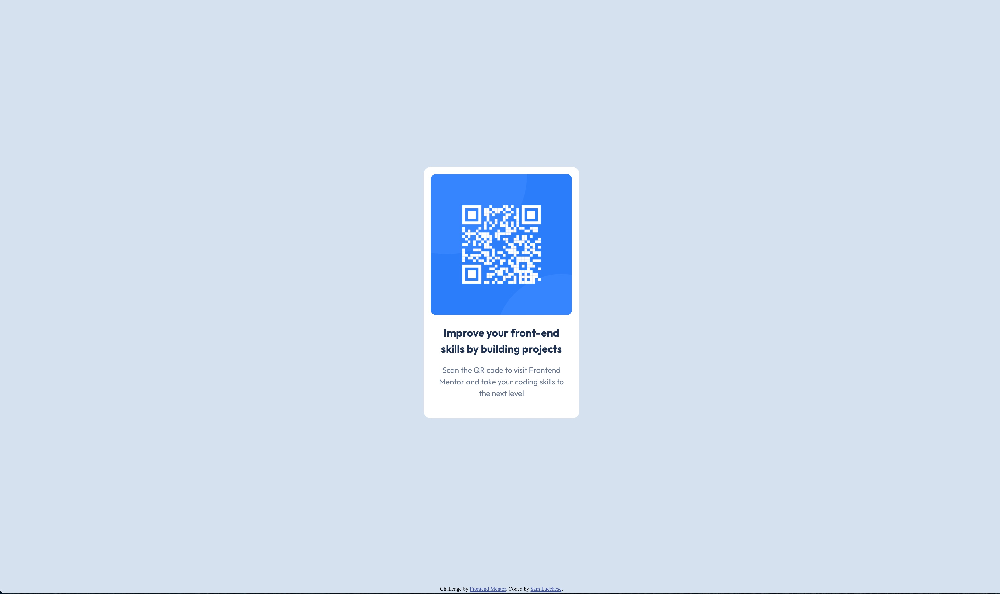

# Frontend Mentor - QR code component solution

This is a solution to the [QR code component challenge on Frontend Mentor](https://www.frontendmentor.io/challenges/qr-code-component-iux_sIO_H). Frontend Mentor challenges help you improve your coding skills by building realistic projects.

## Table of contents

- [Overview](#overview)
  - [Screenshot](#screenshot)
  - [Links](#links)
- [My process](#my-process)
  - [Built with](#built-with)
- [Author](#author)

## Overview

### Screenshot

### Links

- Solution URL: [Frontend Mentor]( https://www.frontendmentor.io/solutions/responsive-qr-component-using-scss-p6Fx_gUjsY)
- Live Site URL: [Github Pages](https://samlucchese.github.io/QR-Code-Component/)

## My process

1. Analyze the design guidelines
2. Clone gulp-template
4. Set up HTML file with classes, links, and image files, set up structure
5. Add specific styling based on the design file

### Built with

- Semantic HTML5 markup
- CSS custom properties
- Scss
- Flexbox

## Author

- Frontend Mentor - [@samlucchese](https://www.frontendmentor.io/profile/samlucchese)
- LInkedIn- 